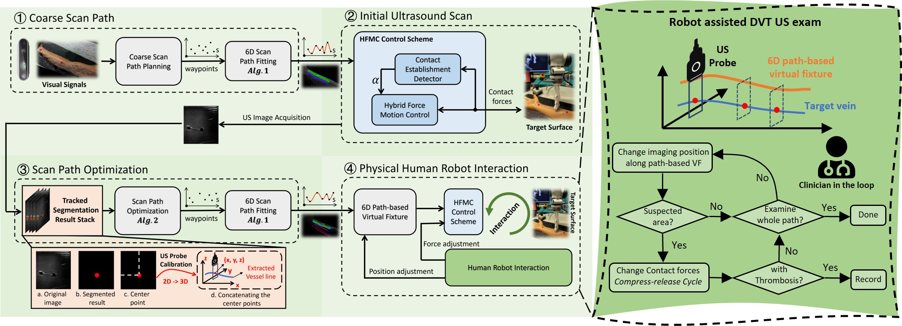
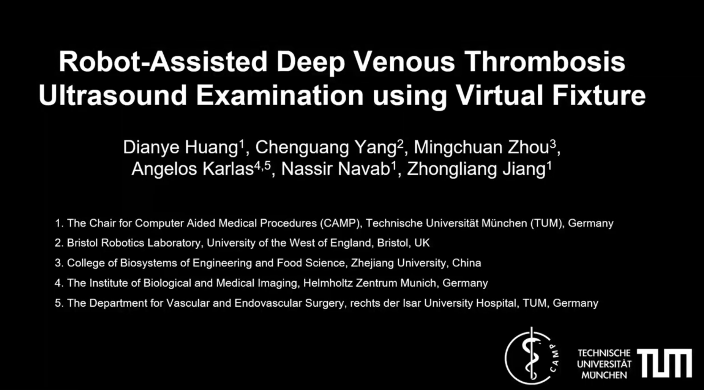
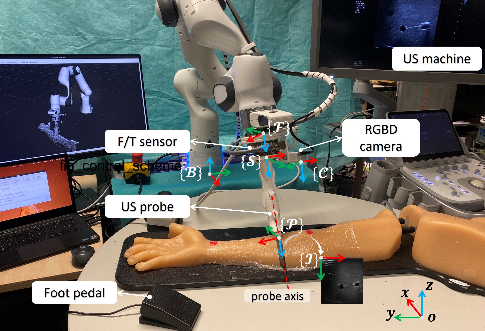

<!--
 * @Author: Dianye Huang
 * @Date: 2024-01-04 17:32:28
 * @LastEditors: Dianye dianye.huang@tum.de
 * @LastEditTime: 2024-01-04 19:04:08
 * @Description: 
-->

# Robot-Assisted Deep Venous Thrombosis Ultrasound Examination using Virtual Fixture

### Introduction
Deep Venous Thrombosis (DVT) is a common vascular disease with blood clots inside deep veins, which may block blood flow or even cause a life-threatening pulmonary embolism. This work presents a semi-autonomous robotic DVT-US exam framework, which consists of a hybrid force-motion control scheme, a coarse-to-fine path planning module, and a physical interaction interface. The whole system is evaluated on a human-like arm phantom with an uneven surface. The intuitive demonstration can be seen here: https://www.youtube.com/watch?v=3xFyqU1rV8c



### Video Demo
[](https://www.youtube.com/watch?v=3xFyqU1rV8c)

#### Repository description
This repository includes codes for implementing the vessel segmentation network and path planning pipeline. 


##### File structure
Below lists part of the 
```
├── franka_networks
│   └── scripts
│       ├── inference.py
│       ├── record_usimg_pose.py
│       ├── training.py
└── franka_path
    └── scripts
        ├── vesselscanpath.py
        └── path_planning.py
```
- **training.py**: training a unet
- **inference.py**: inference of a trained unet
- **record_usimg_pose.py**: run under the ros framework, subscribes the US image, does the segmentation, and the computes the center point of the target vein.
- **vesselscanpath.py**: performs 6D path fitting over a arc-length parameter
- **path_planning.py**: governs the whole path planning pipeline

#### Citation
This work has been accepted by IEEE T-ASE and will be presented in IROS24. If you found this work interesting and adopted part of it to your own research, or if this work inspires your research, you can cite our paper by:
```
@ARTICLE{dvthu24,
  title     = {Robot-Assisted Deep Venous Thrombosis Ultrasound Examination using Virtual Fixture},
  author    = {Dianye, Huang, and Chenguang, Yang and Mingchuan, Zhou and Angelos, Karlas and Nassir, Nava and Zhongliang,  Jiang},
  journal = {IEEE Transactions on Automation Science and Engineering},
  year = {2024}
}
```
